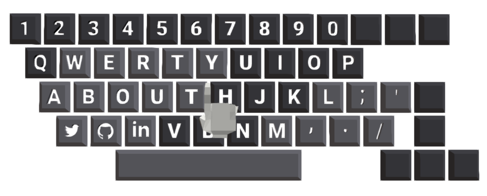
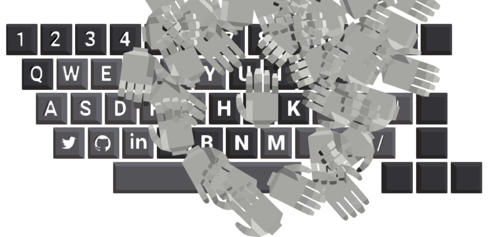
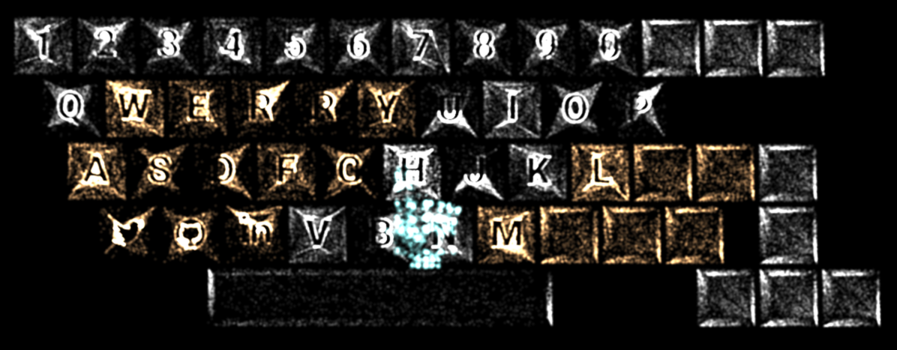

[](http://kenji-special.info/)
http://kenji-special.info/

#portfolio-2017

source codes for kenji saito portfolio site for 2017(http://kenji-special.info/). it is pure webgl site. I used three.js for building webgl.

#sketches
sketches were made based on portfolio codes. the basic function and data are same, but the effects to the por are different.

####sketch00

[](http://kenji-special.info/sketches/00)

http://kenji-special.info/sketches/00

codes: https://github.com/kenjiSpecial/portfolio-2017/tree/sketch00

####sketch01

[](http://kenji-special.info/sketches/01)

http://kenji-special.info/sketches/01

codes: https://github.com/kenjiSpecial/portfolio-2017/tree/sketch01


## Usage


the dev environment is based on ["budo-gulp-starter"](https://github.com/mattdesl/budo-gulp-starter) by [Matt](https://github.com/mattdesl)

```sh
git clone https://github.com/mattdesl/budo-gulp-starter.git
cd budo-gulp-starter

# install dependencies
npm install

# start development server & open browser
npm run open
```

## tasks

```
npm run
  start  - start dev server
  open   - start dev server and open the browser to localhost
  build  - the compressed production build
```

## License

MIT, see [LICENSE.md](http://github.com/mattdesl/budo-gulp-starter/blob/master/LICENSE.md) for details.
